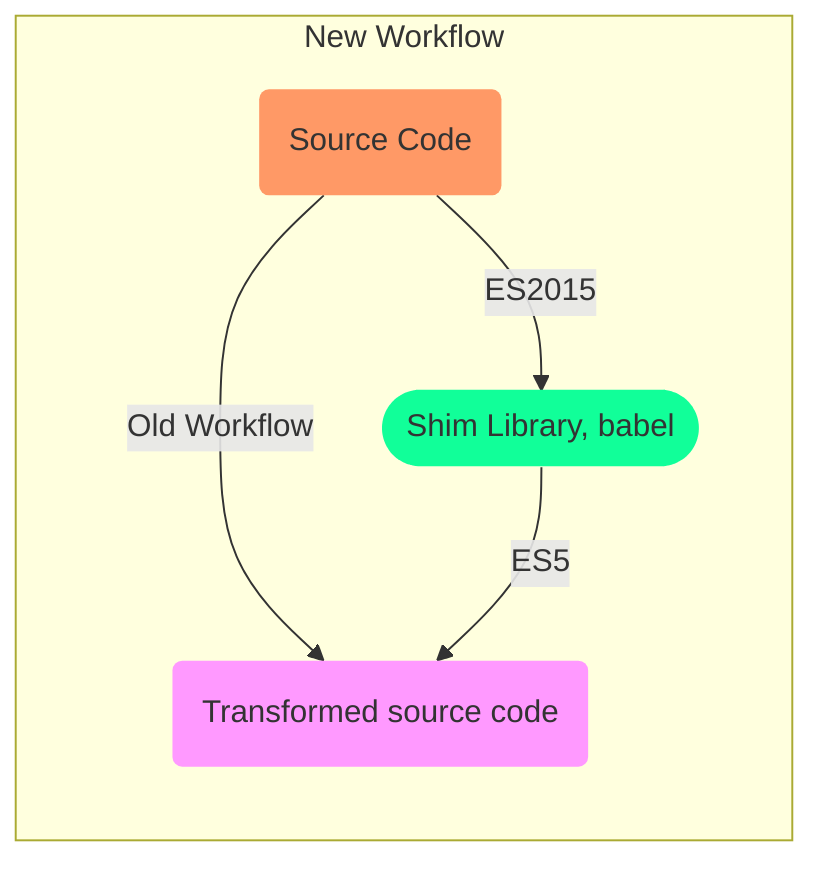

# Test

<TagLinks />

## Jest Failing

Jest fails when it sees `import` in component file?
:   Unexpected Token

    This usually means that you are trying to import a file which Jest cannot parse, e.g. it's not plain JavaScript.

    Points something related to jest and babel

## Babel

> Javascript is moving so fast these days that browsers are lacking behind



::: tip
Babel is like python 2to3 tool, or python 3to2 tool
:::

* use new JS features without breaking in old browsers
* [Babel REPL live editor](https://babeljs.io/repl)

Babel brodges the gaps between old and new JS standards, [Polyfill](https://en.wikipedia.org/wiki/Polyfill_(programming))
:   In web development, a polyfill is code that implements a feature on web browsers that do not support the feature. Most often, it refers to a JavaScript library that implements an HTML5 web standard, either an established standard (supported by some browsers) on older browsers, or a proposed standard (not supported by any browsers) on existing browsers. Formally, "a polyfill is a shim for a browser API".

    Also know as indirection, shim Library in many context

    ```js
    const arr = [1,2,3]
    console.log(...arr)
    ```

Why use it in the first place?
:   To start using advanced JS features

    1. Option chaning, browser will not complain if key of not found in json chaining
    2. Use [Property Spread Operator](https://developer.mozilla.org/en-US/docs/Web/JavaScript/Reference/Operators/Spread_syntax)


## Vue Test Utils

Differencce b/w `mount` and `shallow mount`?
:   `mount` will mount all components along with its child components

    `Shallow mount` only mounts the parent component and **skips** children

Mocha, chain vs Jest?
:   Jest has `snapshots` which Mocha, chai doesnt have

Packages

1. flush-promises - when dealing with asynchronous promises
2. @vue/cli-plugin-unit-jest
3. @vue/test-utils

{{ $page }}

`pwd` is a linux command

<Test />

<Footer />
